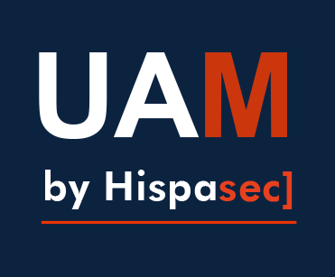

# Una Al Mes, por Hispasec
Se ha elaborado este repositorio público para facilitar la adquisición de nuevos conocimientos de aquellas personas que se estén iniciando en el mundo de la ciberseguridad, con el objetivo de dar continuidad a la razón por la que fue creada la Una Al Mes, la cual se basa en, además de lo ya mencionado, la idea de que los participantes puedan dar sus primeros pasos en las competiciones CTF (Capture The Flag).

En este repositorio se irán incorporando mes a mes los retos que se vayan retirando de la [plataforma oficial](https://unaalmes.hispasec.com), aportando un "Writeup" en el que se explicará cuál es la vía principal para resolver el reto, ayudando a los menos experimentados a adquirir un conocimiento base y, asimismo, esperando aportar nuevas metodologías a los más experimentados.

Junto con el Writeup se aportarán los binarios del reto para poder desplegarlo en local, de forma que quien no haya podido completar el reto en la plataforma pueda hacerlo en su propia máquina, sin tener la limitación que conlleva tener simplemente un documento explicativo.

